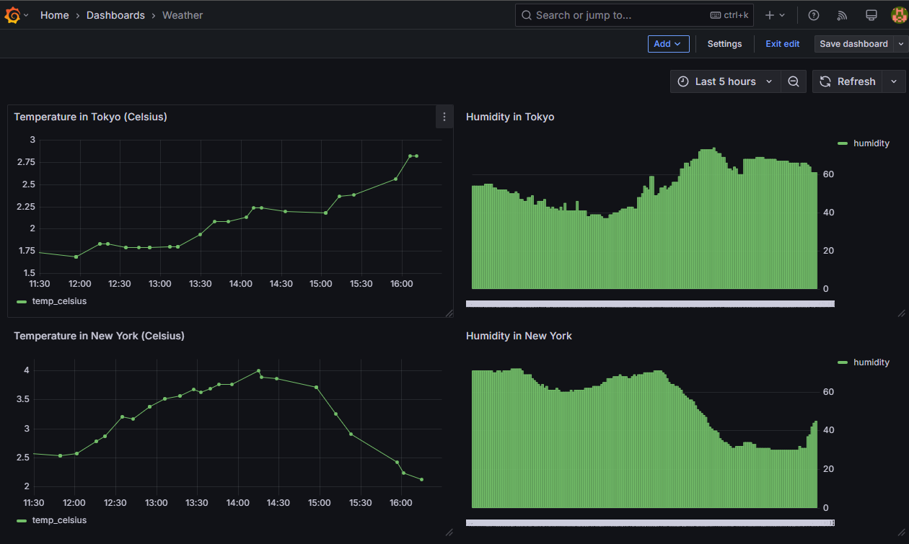

# Weather Pipeline

## Overview
This project showcases a modern, real-time data engineering pipeline that collects, processes, and visualizes weather data. The pipeline integrates the following components:

- **Data Source**: Weather data is fetched from the OpenWeatherMap API for major cities including New York, London, and Tokyo.
- **Streaming**: Apache Kafka, paired with ZooKeeper, handles scalable message brokering.
- **Orchestration**: Apache Airflow schedules and manages data ingestion and processing tasks every 10 minutes.
- **Storage**: Processed weather data is stored in PostgreSQL for efficient querying and persistence.
- **Visualization**: A dynamic Grafana dashboard provides real-time insights into weather metrics such as temperature, humidity, and timestamps.

## Features
- Real-time weather data collection every 10 minutes from OpenWeatherMap.
- Scalable data streaming using Kafka for reliable message handling.
- Robust data processing and storage in PostgreSQL with built-in error handling.
- Interactive Grafana visualizations for monitoring temperature, humidity, and time-series trends.

## Dashboard Snapshot
Below is a snapshot of the Grafana dashboard, showcasing real-time temperature and humidity trends for Tokyo and New York over a 5-hour period (as of March 3, 2025):



The dashboard displays:
- Temperature (in Celsius) and humidity trends for Tokyo and New York.
- Time-series data updated every 10 minutes, covering the last 5 hours.
- Clear, color-coded graphs for easy interpretation of weather patterns.

## Prerequisites
To set up and run this project, ensure you have the following:

- **Docker** and **Docker Compose** for containerized deployment.
- **Python 3.8+** for development and scripting.
- An **OpenWeatherMap API key** to fetch weather data (sign up at [openweathermap.org](https://openweathermap.org) to obtain one).

## Getting Started
**Clone the Repository**:
   ```bash
   git clone https://github.com/raghuarunmaram/weather-pipeline
   cd weather-pipeline
